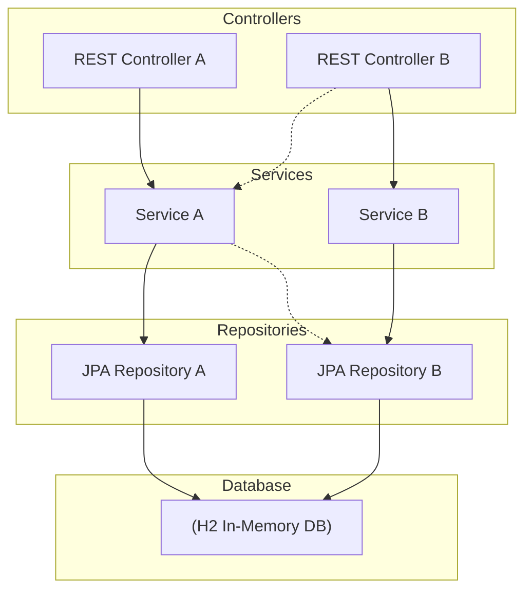

# 🏓 Pong - Tennis Player Registration API

A RESTful API built with **Spring Boot 4** and **H2 in-memory database** for managing tennis player registrations.

## 📋 Features

- **Register** a new tennis player
- **Get** a player by ID
- **List** all registered players
- **Delete** a player by ID
- Input **validation** (name, email, ranking)
- Duplicate email detection
- **Swagger UI** for interactive API testing
- **H2 Console** for database inspection

## 🛠️ Tech Stack

| Technology       | Version |
|-----------------|---------|
| Java            | 25      |
| Spring Boot     | 4.0.3   |
| Spring Data JPA | —       |
| H2 Database     | —       |
| SpringDoc OpenAPI| 2.8.6  |
| JUnit 5         | —       |
| Mockito         | —       |

## Architecture


## 🚀 Getting Started

### Prerequisites

- **Java 25** (or compatible JDK)

### Run the Application

```bash
./gradlew bootRun
```

The application starts on **http://localhost:8080**.

### Run Tests

```bash
./gradlew test
```

## 📖 API Endpoints

| Method   | Endpoint             | Description              |
|----------|---------------------|--------------------------|
| `POST`   | `/api/players`      | Register a new player    |
| `GET`    | `/api/players/{id}` | Get a player by ID       |
| `GET`    | `/api/players`      | Get all players          |
| `DELETE` | `/api/players/{id}` | Delete a player by ID    |

### Request Body (POST /api/players)

```json
{
  "firstName": "Roger",
  "lastName": "Federer",
  "email": "roger.federer@tennis.com",
  "country": "Switzerland",
  "ranking": 3
}
```

### Validation Rules

| Field       | Rules                                          |
|------------|------------------------------------------------|
| `firstName`| Required, 2–50 characters                      |
| `lastName` | Required, 2–50 characters                      |
| `email`    | Required, must be a valid email, must be unique |
| `country`  | Optional, max 100 characters                   |
| `ranking`  | Optional, must be between 1 and 10 000          |

### Response Example

```json
{
  "id": 1,
  "firstName": "Roger",
  "lastName": "Federer",
  "email": "roger.federer@tennis.com",
  "country": "Switzerland",
  "ranking": 3
}
```

### Error Response Example

```json
{
  "timestamp": "2026-03-18T10:30:00",
  "status": 400,
  "error": "Bad Request",
  "message": "firstName: First name is required, email: Email must be valid"
}
```

## 🧪 Testing with Swagger UI

1. Start the application:
   ```bash
   ./gradlew bootRun
   ```

2. Open **Swagger UI** in your browser:
   ```
   http://localhost:8080/swagger-ui.html
   ```

3. You will see all available endpoints grouped under **Tennis Players**.

4. **To register a player:**
   - Expand `POST /api/players`
   - Click **"Try it out"**
   - Edit the JSON body with player details
   - Click **"Execute"**
   - See the `201 Created` response with the player data

5. **To get all players:**
   - Expand `GET /api/players`
   - Click **"Try it out"** → **"Execute"**

6. **To get a player by ID:**
   - Expand `GET /api/players/{id}`
   - Click **"Try it out"**
   - Enter the player ID
   - Click **"Execute"**

7. **To delete a player:**
   - Expand `DELETE /api/players/{id}`
   - Click **"Try it out"**
   - Enter the player ID
   - Click **"Execute"**
   - See the `204 No Content` response

## 🗄️ H2 Database Console

You can inspect the database directly:

1. Open **http://localhost:8080/h2-console**
2. Use the following settings:
   - **JDBC URL:** `jdbc:h2:mem:pongdb`
   - **User Name:** `sa`
   - **Password:** *(leave empty)*
3. Click **Connect**
4. Run SQL queries, e.g.: `SELECT * FROM PLAYERS;`

## 📁 Project Structure

```
src/main/java/com/dynatrace/pong/
├── PongApplication.java              # Application entry point
├── controller/
│   └── PlayerController.java         # REST controller with validation
├── dto/
│   ├── PlayerRequest.java            # Input DTO with validation annotations
│   └── PlayerResponse.java           # Output DTO
├── exception/
│   ├── DuplicateEmailException.java  # Thrown when email already exists
│   ├── GlobalExceptionHandler.java   # Centralized error handling
│   └── PlayerNotFoundException.java  # Thrown when player not found
├── model/
│   └── Player.java                   # JPA entity
├── repository/
│   └── PlayerRepository.java         # Spring Data JPA repository
└── service/
    └── PlayerService.java            # Business logic layer

src/test/java/com/dynatrace/pong/
├── PongApplicationTests.java         # Context load test
├── controller/
│   └── PlayerControllerTest.java     # Controller unit tests (MockMvc)
├── repository/
│   └── PlayerRepositoryTest.java     # Repository integration tests
└── service/
    └── PlayerServiceTest.java        # Service unit tests (Mockito)
```

{
  "firstName": "John",
  "lastName": "Doe",
  "email": "john.doe@example.com",
  "country": "USA",
  "ranking": 1
}
{
  "firstName": "Jane",
  "lastName": "Smith",
  "email": "jane.smith@example.com",
  "country": "Canada",
  "ranking": 2
}